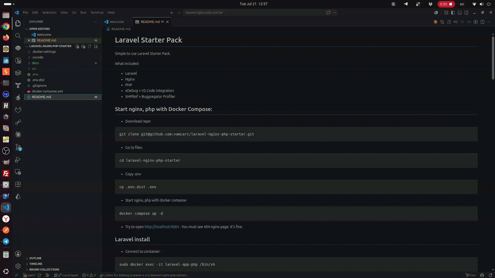

# Laravel Starter Pack

Simple to use Laravel Starter Pack.

What included:

* Laravel
* Nginx
* PHP
* xDebug + VS Code integration
* XHProf + Buggregator Profiler
* mySQL
* phpMyAdmin

## Start nginx, php with Docker Compose:

* Download repo:
```
git clone git@github.com:vamcart/laravel-nginx-php-starter.git
```
* Go to files:
```
cd laravel-nginx-php-starter
```
* Copy .env
```
cp .env.dist .env
```
* Start nginx, php with docker compose
```
docker compose up -d
```
* Try to open http://localhost:8084 . You must see 404 nginx page. It's fine.

## Laravel install

* Connect to container:
```
sudo docker exec -it laravel-app-php /bin/sh
```
* Install laravel
```
composer create-project laravel/laravel ./
```
* Set permissions
```
chmod -R 777 public storage database
```
* Ths't all, your laravel copy ready to develop. Open http://localhost:8084 , you must see Laravel welcome page.

## XDebug + VS Code

* Open file at VS Code, for example /src/routes/web.php
* Add breakpoint, start XDebug by F5 button.
* Open http://localhost:8084 in your browser.
* VS Code will stop on your breakpoint. 



## XHProf + Buggregator

Add XHProf + Buggregator support to your Laravel app.


* Connect to container:
```
sudo docker exec -it laravel-app-php /bin/sh
```

* Add composer package:
```php
composer require --dev maantje/xhprof-buggregator-laravel
```
Buggregator Web UI available at: http://localhost:8000

All requests to laravel app http://localhost:8084 will be available in Buggregator Profile tab.

* Remove XHProf + Buggregator support from your Laravel app:
```php
composer remove maantje/xhprof-buggregator-laravel
```
## mySQL

Host: 
```
database
```
Port: 
```
3306
```
Database: 
```
docker
```
User: 
```
docker
```
Password: 
```
docker
```

## phpMyAdmin

http://localhost:8085

Login:
```
docker
```
Password: 
```
docker
```

## Bugs

If Profiler tab in Buggregator is empty, and laravel log at /storage/logs/ has - 400 bad request error.

You need to fix spiral profiler file.

/src/vendor/spiral-packages/profiler/src/storage/WebStorage.php

Change:
```php
    public function store(string $appName, array $tags, \DateTimeInterface $date, array $data): void
    {
        $this->options['json'] = [
            'profile' => $this->converter->convert($data),
            'tags' => $tags,
            'app_name' => $appName,
            'hostname' => \gethostname(),
            'date' => $date->getTimestamp(),
        ];
```        
to:
```php
    public function store(string $appName, array $tags, \DateTimeInterface $date, array $data): void
    {
        $this->options['json'] = [
            'profile' => $this->converter->convert($data),
            //'tags' => $tags,
            'app_name' => $appName,
            'hostname' => \gethostname(),
            'date' => $date->getTimestamp(),
        ];
```

After that Profiler tab is working fine at Buggregator.